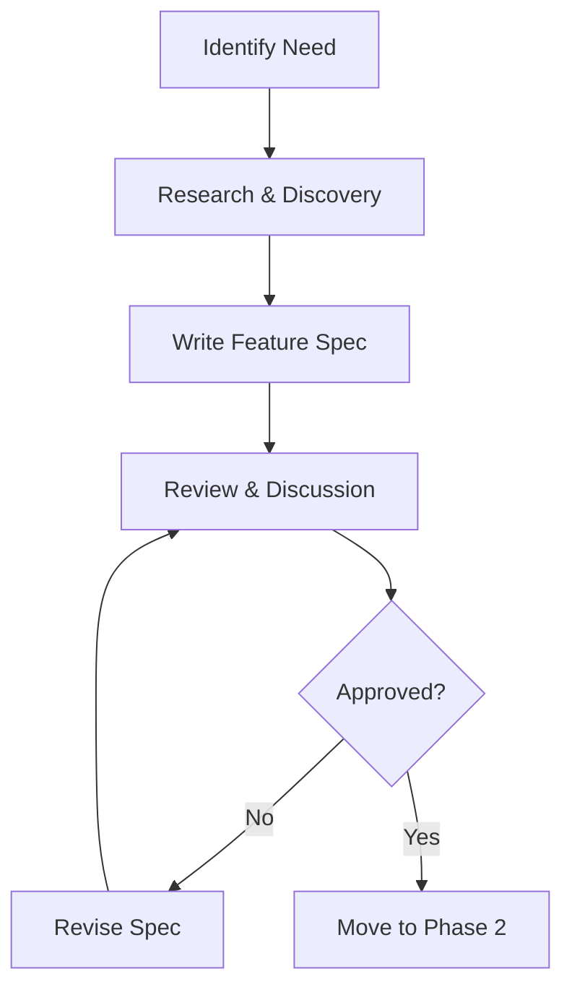
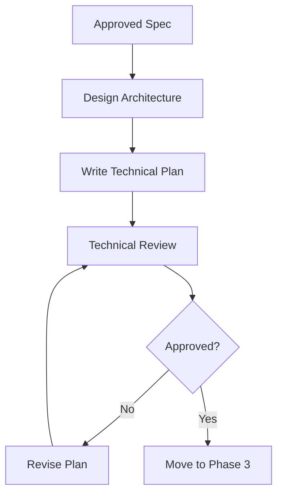
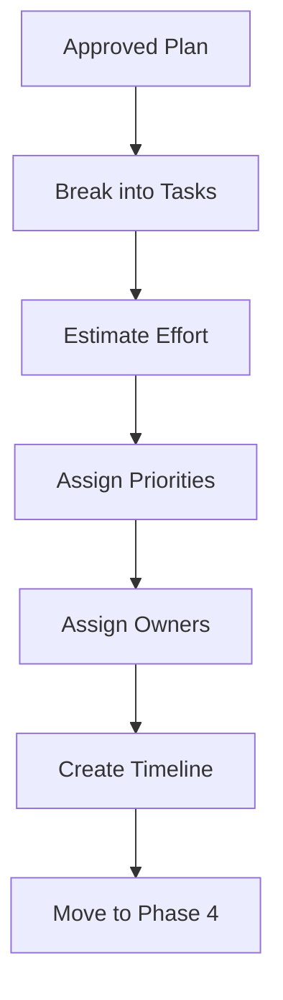
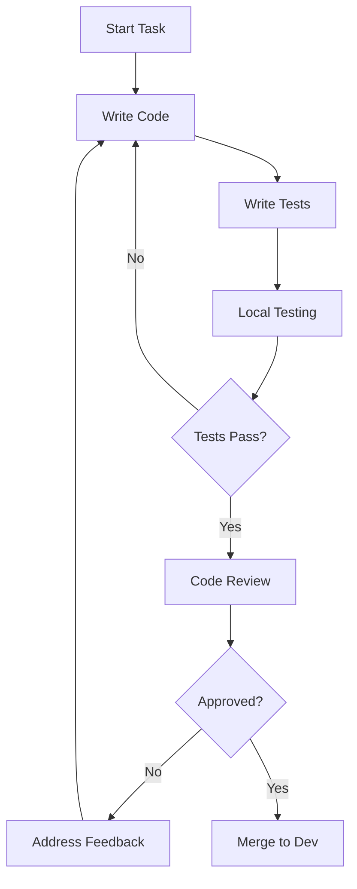
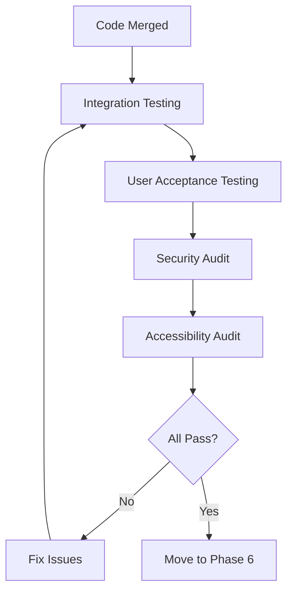
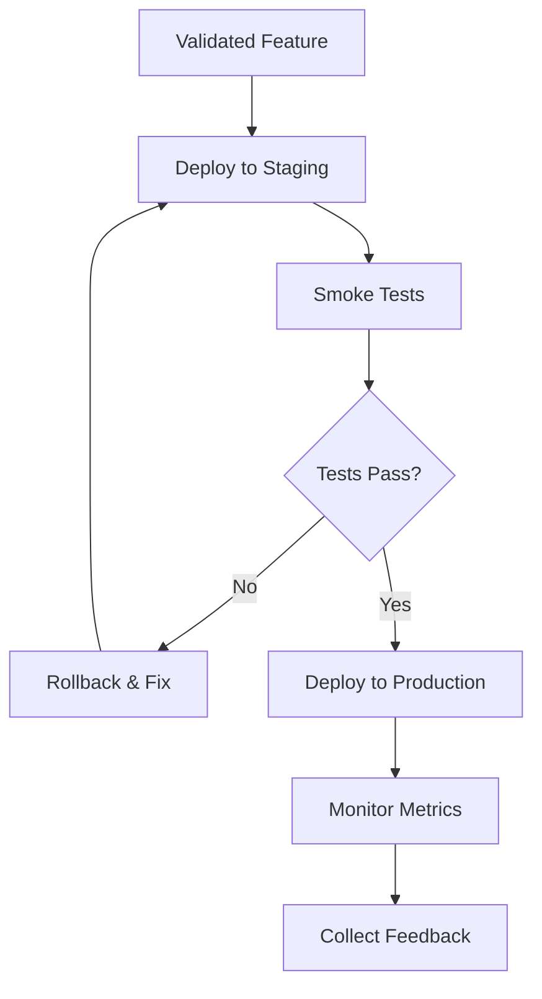
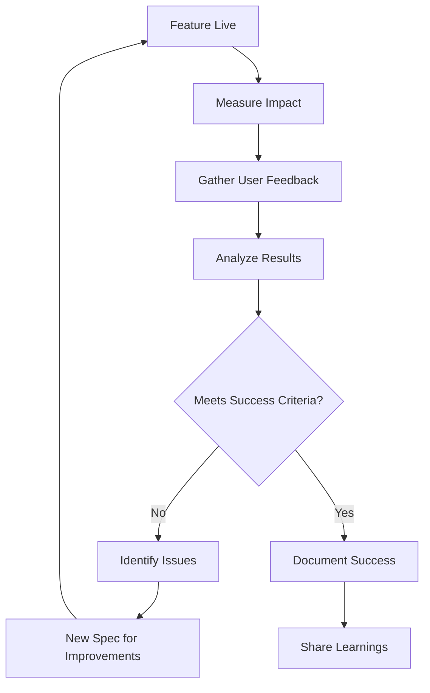

# Spec-Driven Development Workflow

**Version**: 1.0
**Date**: 2025-11-07
**Status**: Active

---

## Table of Contents

1. [Overview](#overview)
2. [Core Principles](#core-principles)
3. [The Workflow](#the-workflow)
4. [Step-by-Step Guide](#step-by-step-guide)
5. [Templates](#templates)
6. [Examples](#examples)
7. [Best Practices](#best-practices)
8. [Common Pitfalls](#common-pitfalls)
9. [Tools & Resources](#tools--resources)

---

## Overview

The RBE Platform uses **Spec-Driven Development** as our core methodology. This approach ensures that every feature is:

- **Well-planned** before implementation begins
- **Aligned** with RBE principles and our Constitution
- **Documented** for current and future contributors
- **Testable** with clear success criteria
- **Transparent** in decision-making and rationale

**The Golden Rule:** *Specifications before Implementation*

---

## Core Principles

### 1. Think Before You Code

Every feature starts with a specification document that answers:
- **What** are we building?
- **Why** are we building it?
- **Who** will benefit?
- **How** does it align with RBE principles?

### 2. Scientific Method Approach

Our workflow follows the scientific method:

```
Observation → Hypothesis → Experimentation → Analysis → Iteration
     ↓             ↓              ↓              ↓           ↓
  Identify    Write Spec    Implement      Measure      Refine
  Problem                   & Test         Results
```

### 3. Transparency & Collaboration

All specifications are:
- Public and version-controlled
- Open for community input
- Reviewed by multiple stakeholders
- Updated based on learning

### 4. Quality Over Speed

We prioritize:
- Correctness over rapid development
- Long-term sustainability over shortcuts
- Accessibility and inclusivity from day one
- Comprehensive testing before deployment

---

## The Workflow

### Phase 1: Specification (The "What" and "Why")



**Deliverable**: Feature Specification Document

### Phase 2: Technical Planning (The "How")



**Deliverable**: Technical Plan Document

### Phase 3: Task Breakdown (The "Who" and "When")



**Deliverable**: Task Breakdown Document

### Phase 4: Implementation (Build It)



**Deliverable**: Working, Tested Code

### Phase 5: Validation (Verify It)



**Deliverable**: Validated Feature

### Phase 6: Deployment (Ship It)



**Deliverable**: Deployed Feature + Monitoring

### Phase 7: Iteration (Improve It)



**Deliverable**: Impact Report + Learnings

---

## Step-by-Step Guide

### Step 1: Identify the Need

**Who**: Anyone (developers, users, community members)
**When**: Continuous
**Output**: Problem statement or opportunity description

**Actions:**
1. Observe a problem or opportunity
2. Research if it's already addressed
3. Check alignment with RBE principles
4. Create GitHub issue describing the need

**Example:**
```markdown
## Need: AI-Powered Resource Optimization

**Problem**: Resource allocation decisions are currently manual and may miss
optimization opportunities.

**Opportunity**: ML algorithms can analyze patterns and suggest improvements.

**RBE Alignment**: Supports Principle 2 (scientific decisions) and Principle 7
(continuous learning).

**Impact**: Could improve resource efficiency by 10-15%.
```

### Step 2: Write Feature Specification

**Who**: Feature owner (usually developer or product manager)
**When**: Before any code is written
**Template**: `.speckit/templates/FEATURE_SPEC_TEMPLATE.md`
**Output**: Feature Specification Document

**Actions:**
1. Copy the feature spec template
2. Fill in all 16 sections thoroughly
3. Ensure RBE Constitution alignment is explicit
4. Define clear success metrics
5. Consider accessibility, security, and ethics from the start
6. Save in `.speckit/specs/` with descriptive name

**Quality Checklist:**
- [ ] Clear problem statement
- [ ] Well-defined user stories
- [ ] Success criteria are measurable
- [ ] RBE principle alignment documented
- [ ] Accessibility considered
- [ ] Security considerations addressed
- [ ] Alternative approaches evaluated
- [ ] Risk mitigation strategies defined

**Example Path:**
`.speckit/specs/phase-2/SPEC_AI_RESOURCE_OPTIMIZATION.md`

### Step 3: Review & Discuss Specification

**Who**: Core team + relevant stakeholders
**When**: After initial spec draft
**Platform**: GitHub Pull Request or Discussion

**Review Checklist:**
- [ ] Aligns with RBE Constitution (Section 3)
- [ ] Serves humanity's best interests (Constitution Section 2.1)
- [ ] Technically feasible
- [ ] Resource requirements reasonable
- [ ] Success criteria measurable
- [ ] Risks adequately addressed
- [ ] Accessibility compliant
- [ ] Security sound

**Roles:**
- **Product Review**: Does it solve the right problem?
- **Technical Review**: Is it feasible?
- **RBE Review**: Does it align with principles?
- **Security Review**: Are there vulnerabilities?
- **Accessibility Review**: Can everyone use it?

**Actions:**
1. Create pull request with spec
2. Request reviews from relevant stakeholders
3. Address feedback and questions
4. Revise spec based on discussion
5. Get minimum 2 approvals (per Constitution 4.3)
6. Merge spec to main branch

### Step 4: Write Technical Plan

**Who**: Technical lead or senior developer
**When**: After spec approval
**Template**: `.speckit/templates/TECHNICAL_PLAN_TEMPLATE.md`
**Output**: Technical Plan Document

**Actions:**
1. Copy the technical plan template
2. Design architecture and data models
3. Define technology stack with justification
4. Write detailed implementation steps
5. Create testing strategy with examples
6. Plan deployment approach
7. Define monitoring & metrics
8. Save in `.speckit/plans/` with same name as spec

**Quality Checklist:**
- [ ] Architecture diagram clear
- [ ] All components defined
- [ ] Technology choices justified
- [ ] Database schema complete
- [ ] API endpoints specified
- [ ] Testing plan comprehensive
- [ ] Deployment steps detailed
- [ ] Rollback plan defined
- [ ] Monitoring strategy clear

**Example Path:**
`.speckit/plans/phase-2/PLAN_AI_RESOURCE_OPTIMIZATION.md`

### Step 5: Review Technical Plan

**Who**: Technical team + DevOps
**When**: After technical plan draft
**Platform**: GitHub Pull Request

**Review Focus:**
- Architecture scalability
- Technology choices
- Database design
- Security implementation
- Performance considerations
- Testing adequacy
- Deployment feasibility

**Actions:**
1. Create pull request with technical plan
2. Request reviews from technical team
3. Discuss architecture in team meeting if needed
4. Address feedback
5. Get minimum 2 technical approvals
6. Merge to main branch

### Step 6: Create Task Breakdown

**Who**: Technical lead + team
**When**: After technical plan approval
**Template**: `.speckit/templates/TASK_BREAKDOWN_TEMPLATE.md`
**Output**: Task Breakdown Document

**Actions:**
1. Copy the task breakdown template
2. Break technical plan into atomic tasks
3. Estimate effort for each task
4. Identify dependencies
5. Assign priorities (P0, P1, P2, P3)
6. Create GitHub issues for each task
7. Link issues to project board
8. Save in `.speckit/tasks/`

**Task Quality:**
Each task should be:
- **Atomic**: Can be completed independently
- **Estimable**: Clear time estimate (hours or days)
- **Testable**: Has acceptance criteria
- **Assignable**: Can be assigned to one person/pair

**Example Path:**
`.speckit/tasks/phase-2/TASKS_AI_RESOURCE_OPTIMIZATION.md`

### Step 7: Implement Tasks

**Who**: Developers
**When**: After task breakdown
**Platform**: Development branch

**Workflow for Each Task:**

1. **Pick Task** from project board (usually highest priority available)

2. **Create Branch**
   ```bash
   git checkout -b feature/TASK-001-description
   ```

3. **Implement Code**
   - Follow technical plan exactly
   - Follow code style guidelines
   - Add JSDoc/comments for complex logic
   - Consider edge cases

4. **Write Tests**
   - Unit tests for functions
   - Component tests for UI
   - Integration tests for APIs
   - Aim for >80% coverage

5. **Test Locally**
   ```bash
   npm test
   npm run lint
   npm run type-check
   ```

6. **Commit Changes**
   ```bash
   git add .
   git commit -m "feat(ai): implement recommendation list API

   - Add GET /api/ai/recommendations endpoint
   - Add filtering and pagination
   - Add validation with Zod
   - Add tests with 90% coverage

   Closes TASK-001"
   ```

7. **Push Branch**
   ```bash
   git push origin feature/TASK-001-description
   ```

8. **Create Pull Request**
   - Use PR template
   - Link to task issue
   - Add screenshots for UI changes
   - Request reviewers

9. **Code Review**
   - Address feedback
   - Make requested changes
   - Re-request review

10. **Merge**
    - After approval, merge to development branch
    - Delete feature branch
    - Update task status to "Done"

### Step 8: Integration Testing

**Who**: QA Engineer + Developers
**When**: After related tasks completed
**Platform**: Staging environment

**Actions:**
1. Deploy to staging environment
2. Run automated integration tests
3. Run manual test scenarios
4. Test cross-browser compatibility
5. Test responsive design
6. Test accessibility with screen reader
7. Perform security testing
8. Document any issues found

**Integration Test Checklist:**
- [ ] All API endpoints work together
- [ ] Frontend integrates with backend correctly
- [ ] Database queries perform adequately
- [ ] Error handling works end-to-end
- [ ] Authentication/authorization works
- [ ] Accessibility tools report no errors
- [ ] Performance meets requirements (Lighthouse >90)

### Step 9: User Acceptance Testing

**Who**: Product manager + Representative users
**When**: After integration testing passes
**Platform**: Staging environment

**Actions:**
1. Create test scenarios from user stories
2. Recruit 3-5 representative users
3. Observe users completing scenarios
4. Collect feedback
5. Document issues and improvements
6. Prioritize fixes
7. Make necessary changes

**UAT Success Criteria:**
- Users can complete all primary user stories
- Users find interface intuitive
- No critical usability issues
- Feedback is positive overall

### Step 10: Deploy to Production

**Who**: DevOps Engineer
**When**: After UAT approval
**Platform**: Production environment

**Deployment Checklist:**
- [ ] All tests passing
- [ ] Code reviewed and approved
- [ ] Database migrations ready
- [ ] Rollback plan documented
- [ ] Monitoring configured
- [ ] Alerts set up
- [ ] Team notified of deployment time
- [ ] Deployment window scheduled

**Deployment Steps:**
1. Announce deployment in team chat
2. Run database migrations
3. Deploy backend services
4. Deploy frontend (with feature flag disabled)
5. Run smoke tests
6. Enable feature flag for 10% of users
7. Monitor metrics for 24 hours
8. Gradually increase to 100% over 1 week
9. Announce feature in release notes

### Step 11: Monitor & Measure

**Who**: DevOps + Product Manager
**When**: Immediately after deployment and ongoing
**Platform**: Monitoring dashboard

**Metrics to Track:**
- **Technical**: Error rates, response times, uptime
- **User**: Engagement, feature usage, user feedback
- **Business**: Success metrics from spec (e.g., efficiency gain)
- **RBE**: Impact on principles implementation

**Actions:**
1. Set up monitoring dashboards
2. Configure alerts for anomalies
3. Track success metrics daily
4. Collect user feedback via surveys
5. Review metrics weekly in team meeting
6. Create impact report after 1 month

### Step 12: Iterate & Improve

**Who**: Entire team
**When**: Ongoing
**Output**: Lessons learned + Improvement specs

**Actions:**
1. Analyze metrics vs. success criteria
2. Gather user feedback
3. Identify improvements needed
4. Document lessons learned
5. If changes needed:
   - Create new spec for improvements
   - Return to Step 2
6. Update original spec with "Actual Results" section

**Impact Report Sections:**
- What we built
- Success metrics achieved
- User feedback summary
- Unexpected outcomes
- Lessons learned
- Next steps

---

## Templates

All templates are located in `.speckit/templates/`:

1. **FEATURE_SPEC_TEMPLATE.md**
   - Use for: Defining what to build and why
   - Sections: 16 comprehensive sections
   - When: Before any code is written

2. **TECHNICAL_PLAN_TEMPLATE.md**
   - Use for: Defining how to build it
   - Sections: 13 detailed sections
   - When: After spec approval

3. **TASK_BREAKDOWN_TEMPLATE.md**
   - Use for: Breaking plan into tasks
   - Sections: Tasks by category with estimates
   - When: After technical plan approval

---

## Examples

Complete examples are in `.speckit/examples/`:

### Example: AI Resource Optimization

**Feature Spec**: `FEATURE_SPEC_AI_RESOURCE_OPTIMIZATION.md`
- Comprehensive 16-section specification
- Shows how to align with RBE principles
- Demonstrates user stories and success metrics

**Technical Plan**: `TECHNICAL_PLAN_AI_RESOURCE_OPTIMIZATION.md`
- Architecture diagrams
- Database schema with SQL
- API endpoint implementations
- Testing strategy with code examples

**How to Use Examples:**
1. Read through both documents
2. Note the level of detail required
3. See how spec and plan connect
4. Use as reference when creating your own

---

## Best Practices

### For Writing Specifications

1. **Be Specific**
   - ❌ "Improve performance"
   - ✅ "Reduce API response time from 500ms to <200ms (p95)"

2. **Define Success Measurably**
   - ❌ "Users like the feature"
   - ✅ "User satisfaction score >4.0/5.0 (n>100 responses)"

3. **Consider Edge Cases**
   - What if there's no data?
   - What if the API is down?
   - What if user has slow connection?

4. **Think Globally**
   - Will this work in low-bandwidth areas?
   - Is it accessible to people with disabilities?
   - Does it support multiple languages?

5. **Align with RBE Principles**
   - Explicitly state which principles are supported
   - Explain how the feature serves humanity
   - Consider environmental impact

### For Technical Planning

1. **Justify Choices**
   - Don't just pick familiar tech
   - Compare alternatives
   - Document why you chose X over Y

2. **Plan for Scale**
   - Design for 10x current usage
   - Consider geographic distribution
   - Plan for data growth

3. **Security First**
   - Identify threats early
   - Plan mitigation strategies
   - Follow OWASP top 10

4. **Test Early, Test Often**
   - Define testing strategy upfront
   - Write tests alongside code
   - Aim for >80% coverage

5. **Document Everything**
   - Future you will thank you
   - New contributors will thank you
   - Users will thank you

### For Implementation

1. **Follow the Spec**
   - Don't deviate without updating spec first
   - If you find a better approach, update the spec
   - Keep spec and code in sync

2. **Small, Focused Commits**
   - One logical change per commit
   - Clear, descriptive commit messages
   - Reference task IDs

3. **Review Your Own Code First**
   - Read through your PR before requesting review
   - Test all edge cases
   - Run linters and type checkers

4. **Respond to Feedback Gracefully**
   - Code review is not personal criticism
   - Ask questions if unclear
   - Learn from suggestions

5. **Clean Up After Yourself**
   - Remove console.logs
   - Delete commented code
   - Update documentation

---

## Common Pitfalls

### ❌ **Pitfall #1: Skipping the Spec**

**Problem**: "It's a small change, I'll just code it"

**Why Bad**:
- Loses opportunity for community input
- Misses alternative approaches
- No documentation for future
- May not align with RBE principles

**Solution**: Write a mini-spec even for small features

---

### ❌ **Pitfall #2: Spec Too Vague**

**Problem**: "Build an AI feature to optimize resources"

**Why Bad**:
- Unclear what success looks like
- Implementation could go many directions
- Hard to estimate effort
- Difficult to test

**Solution**: Be specific about requirements, success criteria, and scope

---

### ❌ **Pitfall #3: Code Before Spec**

**Problem**: Writing code then retroactively creating spec

**Why Bad**:
- Spec becomes documentation, not design
- Misses opportunity to consider alternatives
- Loses the "thinking before coding" benefit
- Sets bad precedent for team

**Solution**: Strictly enforce spec-first policy

---

### ❌ **Pitfall #4: Spec Divergence**

**Problem**: Code doesn't match spec anymore

**Why Bad**:
- Documentation becomes misleading
- New contributors get confused
- Loses spec-driven discipline
- Hard to review changes

**Solution**: Update spec immediately if implementation changes

---

### ❌ **Pitfall #5: Analysis Paralysis**

**Problem**: Spending weeks perfecting spec without shipping

**Why Bad**:
- Delays value to users
- Team loses momentum
- Perfect is enemy of good

**Solution**:
- Set time limit for spec phase (e.g., 1 week max)
- Mark spec as "v1" and iterate
- Ship MVP and improve based on feedback

---

### ❌ **Pitfall #6: Ignoring RBE Alignment**

**Problem**: Not explicitly checking RBE Constitution compliance

**Why Bad**:
- Feature might contradict core principles
- Loses sight of mission
- Could harm instead of help

**Solution**: Make RBE alignment a mandatory review checkpoint

---

## Tools & Resources

### Internal Resources

- **RBE Constitution**: `.speckit/constitution/RBE_PLATFORM_CONSTITUTION.md`
- **Templates**: `.speckit/templates/`
- **Examples**: `.speckit/examples/`
- **This Workflow**: `.speckit/WORKFLOW.md`

### External Resources

- [GitHub Spec Kit](https://github.com/github/spec-kit) - Original methodology
- [C4 Model](https://c4model.com/) - Architecture diagrams
- [WCAG 2.1](https://www.w3.org/WAI/WCAG21/quickref/) - Accessibility guidelines
- [OWASP Top 10](https://owasp.org/www-project-top-ten/) - Security threats
- [The Twelve-Factor App](https://12factor.net/) - Best practices

### Tools

- **Mermaid**: For diagrams in Markdown
- **Draw.io**: For complex architecture diagrams
- **GitHub Issues**: For task tracking
- **GitHub Projects**: For kanban boards
- **GitHub Discussions**: For spec review conversations

---

## FAQ

**Q: What if I find a bug? Do I need a spec?**
A: No. Bug fixes don't need specs. Create issue, fix, test, PR.

**Q: What if the spec was wrong?**
A: Update the spec first, then change the code. Keep them in sync.

**Q: How detailed should a spec be?**
A: Detailed enough that someone else could implement it without asking many questions.

**Q: Can I skip sections of the template?**
A: Mark sections as "N/A" with brief explanation, but consider each section carefully.

**Q: What if I disagree with the spec after it's approved?**
A: Raise concerns early in implementation. If significant, pause and discuss with team.

**Q: How do I handle scope creep?**
A: New requirements = new spec. Don't add features mid-implementation without updating spec.

**Q: What if I'm the only developer?**
A: Still write specs! They help you think through problems and create documentation.

---

## Success Story Example

### Feature: Resource Dashboard (Completed)

**Timeline:**
- Week 1: Feature spec written and approved
- Week 2: Technical plan created and approved
- Week 3-4: Implementation and testing
- Week 5: Deployment and monitoring

**Outcome:**
- ✅ Delivered on time
- ✅ Zero critical bugs in production
- ✅ User satisfaction: 4.2/5.0
- ✅ 80% of users adopted feature within 2 weeks
- ✅ Clear documentation for future contributors

**Key to Success:**
- Thorough spec prevented scope creep
- Technical plan identified risks early
- Task breakdown enabled parallel work
- Testing strategy caught issues before production

---

## Conclusion

Spec-Driven Development is more than a process—it's a philosophy that aligns perfectly with the RBE Platform's mission. By thinking before coding, we ensure that every feature we build:

- **Serves humanity's best interests**
- **Aligns with scientific principles**
- **Is transparent and well-documented**
- **Can be maintained for decades**
- **Welcomes diverse contributions**

> *"The future is not something that happens to us, but something we create."*
> — Jacque Fresco

Let's create it thoughtfully, scientifically, and collaboratively.

---

**Questions or Feedback?**

Open a GitHub Discussion or reach out to the core team. We're continuously improving this workflow based on real-world experience.

**Version History:**
- 1.0 (2025-11-07): Initial workflow documentation

**Next Review**: 2026-01-07 (Quarterly review cycle)
