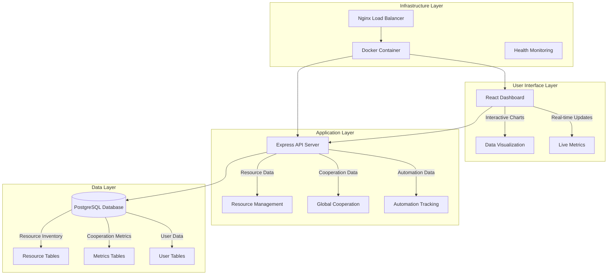
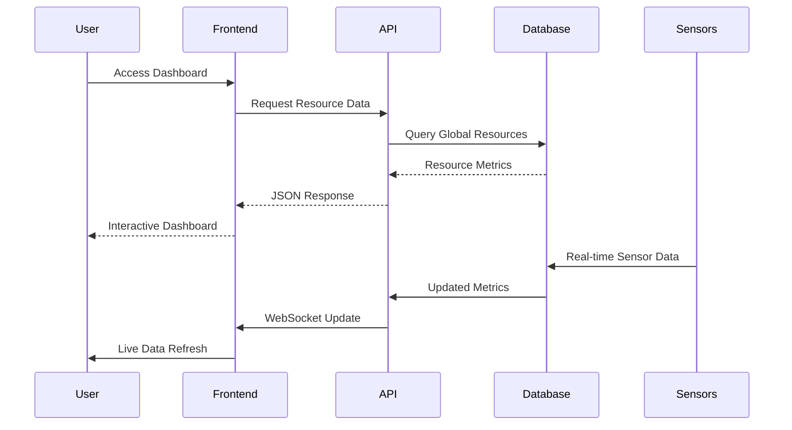

# RBE Platform Architecture

A comprehensive Resource-Based Economy management platform built on Jacque Fresco's Venus Project principles, designed for global cooperation and scientific resource allocation.

## 🏗️ System Overview

The RBE Platform follows a modern, scalable architecture that embodies the principles of cooperation, scientific method, and abundance for all humanity.

### Core Principles
- **Scientific Method**: All decisions based on verifiable data
- **Global Cooperation**: No artificial borders or restrictions
- **Resource Abundance**: Technology serves human needs
- **Environmental Sustainability**: Operating within Earth's carrying capacity
- **Open Source**: Knowledge as common heritage of humanity

## 🎯 Architecture Components

### 1. **Frontend Layer** (React + TypeScript)
- **Venus Project Dashboard**: Interactive visualization of global resources
- **Real-time Metrics**: Live data on cooperation, automation, and sustainability
- **Responsive Design**: Accessible on all devices worldwide
- **Educational Interface**: Built to teach RBE principles

### 2. **Backend API** (Express + TypeScript)
- **Resource Management**: Scientific allocation algorithms
- **Global Cooperation**: Regional and international metrics
- **Automation Tracking**: Progress toward labor liberation
- **Environmental Monitoring**: Sustainability indicators

### 3. **Database Layer** (PostgreSQL)
- **Resource Inventory**: Global resource tracking
- **Cooperation Metrics**: International collaboration data
- **User Contributions**: Community input and feedback
- **Historical Data**: Progress tracking over time

### 4. **Deployment Layer** (Docker + Nginx)
- **Single Container**: Simplified deployment
- **Load Balancing**: Nginx for optimal performance
- **Health Monitoring**: Automated system checks
- **Scalable Infrastructure**: Ready for global deployment

## 📊 System Architecture Diagram

## 🔄 Data Flow Architecture

## 🌍 Global Deployment Architecture

### Production Environment
- **Single Docker Container**: Simplified deployment
- **Nginx Reverse Proxy**: Load balancing and SSL termination
- **PostgreSQL Database**: Separate database service
- **Health Checks**: Automated monitoring and recovery

### Development Environment
- **Docker Compose**: Local development setup
- **Hot Reload**: Frontend and backend development
- **Database Seeding**: Sample data for testing
- **API Documentation**: Interactive development tools

## 🚀 Scalability & Performance

### Horizontal Scaling
- **Microservices Ready**: Modular architecture for scaling
- **Database Sharding**: Geographic data distribution
- **CDN Integration**: Global content delivery
- **Load Balancing**: Multi-instance deployment

### Performance Optimization
- **Caching Strategy**: Redis for frequently accessed data
- **Database Indexing**: Optimized queries for large datasets
- **Image Optimization**: Compressed assets and lazy loading
- **API Rate Limiting**: Fair resource allocation

## 🔒 Security Architecture

### Data Protection
- **Encryption at Rest**: Database encryption
- **Encryption in Transit**: HTTPS/TLS for all communications
- **Input Validation**: Comprehensive data sanitization
- **SQL Injection Prevention**: Parameterized queries

### Access Control
- **Role-Based Access**: Different permission levels
- **API Authentication**: Secure token-based auth
- **Audit Logging**: Complete activity tracking
- **Vulnerability Scanning**: Automated security checks

## 📈 Monitoring & Analytics

### System Monitoring
- **Health Checks**: Automated service monitoring
- **Performance Metrics**: Response time and throughput
- **Error Tracking**: Comprehensive logging and alerting
- **Resource Usage**: CPU, memory, and storage monitoring

### Business Intelligence
- **Global Cooperation Metrics**: International collaboration tracking
- **Resource Utilization**: Efficiency and optimization data
- **User Engagement**: Platform usage and adoption
- **Environmental Impact**: Sustainability measurements

## 🔮 Future Architecture Roadmap

### Phase 1: Foundation (Current)
- ✅ Basic dashboard and API
- ✅ Docker containerization
- ✅ PostgreSQL database
- ✅ Open source documentation

### Phase 2: Intelligence (Next)
- 🔄 AI-powered resource optimization
- 🔄 Machine learning for cooperation patterns
- 🔄 Predictive analytics for sustainability
- 🔄 Automated decision support systems

### Phase 3: Global Integration (Future)
- 🔄 IoT sensor integration
- 🔄 Real-time global resource monitoring
- 🔄 Blockchain for transparent resource tracking
- 🔄 International cooperation protocols

### Phase 4: Post-Monetary Economy (Vision)
- 🔄 Complete resource-based allocation
- 🔄 Global cooperation networks
- 🔄 Automated abundance systems
- 🔄 Scientific governance protocols

## 🛠️ Technology Stack

### Frontend
- **React 18**: Modern UI framework
- **TypeScript**: Type-safe development
- **Tailwind CSS**: Utility-first styling
- **Recharts**: Data visualization
- **Vite**: Fast build tool

### Backend
- **Node.js**: JavaScript runtime
- **Express**: Web framework
- **TypeScript**: Type safety
- **CORS**: Cross-origin resource sharing
- **dotenv**: Environment configuration

### Database
- **PostgreSQL**: Relational database
- **Connection Pooling**: Efficient database connections
- **Migrations**: Schema version control
- **Backups**: Automated data protection

### Infrastructure
- **Docker**: Containerization
- **Nginx**: Web server and reverse proxy
- **GitHub Actions**: CI/CD pipeline
- **Health Checks**: Automated monitoring

## 🌟 RBE-Aligned Design Principles

### 1. **Cooperation Over Competition**
- Open source development
- Community-driven improvements
- Shared knowledge and resources
- Collaborative decision making

### 2. **Scientific Method**
- Evidence-based architecture decisions
- Peer review of all changes
- Data-driven optimization
- Continuous improvement cycles

### 3. **Environmental Responsibility**
- Energy-efficient infrastructure
- Sustainable hosting practices
- Minimal resource consumption
- Carbon-neutral operations

### 4. **Global Accessibility**
- Multi-language support
- Low-bandwidth optimization
- Mobile-first design
- Universal access principles

### 5. **Abundance Mindset**
- Scalable architecture
- Resource sharing protocols
- Open data standards
- Community contribution systems

---

*"The future is not something that happens to us, but something we create."* - Jacque Fresco

*This architecture embodies the vision of a world where technology serves humanity, resources are managed scientifically, and cooperation replaces competition.*

