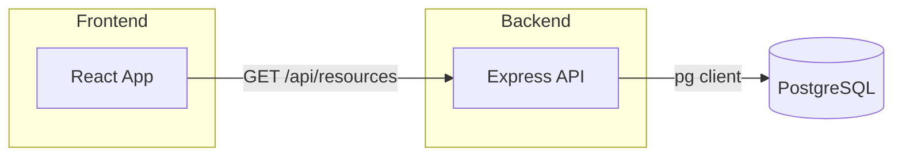

# RBE Platform Architecture

The MVP follows a simple three-service layout orchestrated via `docker-compose`:

1. **Backend API** — Express + TypeScript, exposes `/api/resources` on port 3000.
2. **PostgreSQL** — placeholder for future persistence.
3. **Frontend SPA** — React built with Vite, served by Nginx on port 3000.

Future roadmap: user auth, real-time analytics, optimisation engine.

